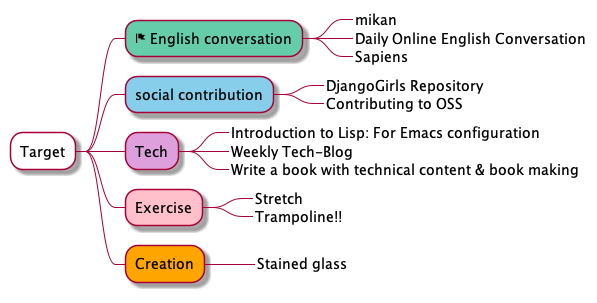

# MindMap
1. MindMap を git 管理したい
2. 誰でもブラウザから最新の MindMap を見られるようにしたい



## ルール
重要度が高いものが原則上位

緊急度が高いもの・素早く片付けたほうが良いタスクには🏁(flag)がつく

※ 重要度が低くても、緊急性が高いものは上位にくる場合もある

## PlantUML
- Org-mode と互換性あり
- 画像生成して image を表示できる

https://plantuml.com/ja/mindmap-diagram

## 初期設定
```sh
Workspace % git clone git@github.com:Ishizuka427/MindMap.git
Workspace % cd MindMap
MindMap % brew install plantuml
MindMap % plantuml test.puml
```

## 更新方法
```sh
MindMap % git pull
MindMap % plantuml test.puml
MindMap % git status
MindMap % git add test.png
MindMap % git commit -m 'update test.png'
MindMap % git push
```

## PlantUML Viewer
- Chrome の拡張機能
- PlantUML で作成したものを GitHub の Raw ボタンから画像で表示してくれる

※ Chrome 拡張機能を入れていないと見られない

## Org-mode (未検証) → 週末に確認する
- plantuml-mode
- org-babel

https://joppot.info/2017/10/30/4091
