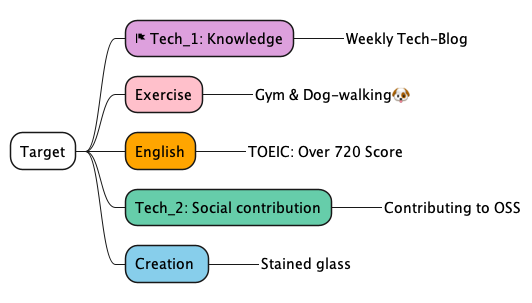

MindMap
Manage goals in the form of a MindMap
Managing the MindMap in git
Anyone can view the latest MindMap from a browser


Rules
Principle: Arrange in order of importance
Tasks with high urgency are marked with a 🏁 (flag).


PlantUML
- Compatible with Org-mode
- Generates images from text data and displays the images, making it suitable for git management

# MindMap
1. Manage goals in the form of a MindMap
2. Managing the MindMap in git
3. Anyone can view the latest MindMap from a browser



## Rules
Principle: Arrange in order of importance
Tasks with high urgency are marked with a 🏁 (flag).

## PlantUML
- Compatible with Org-mode
- Generates images from text data and displays the images, making it suitable for git management

https://plantuml.com/ja/mindmap-diagram

## Initial settings
```sh
Workspace % git clone git@github.com:Ishizuka427/MindMap.git
Workspace % cd MindMap
MindMap % brew install plantuml
MindMap % plantuml test.puml
```

## How to update
```sh
MindMap % git pull
MindMap % plantuml test.puml
MindMap % git status
MindMap % git add test.png
MindMap % git commit -m 'update test.png'
MindMap % git push
```

## PlantUML Viewer
- Chrome の拡張機能
- PlantUML で作成したものを GitHub の Raw ボタンから画像で表示してくれる

※ Chrome 拡張機能を入れていないと見られない

## Org-mode
※ Unverified
- plantuml-mode
- org-babel

https://joppot.info/2017/10/30/4091
